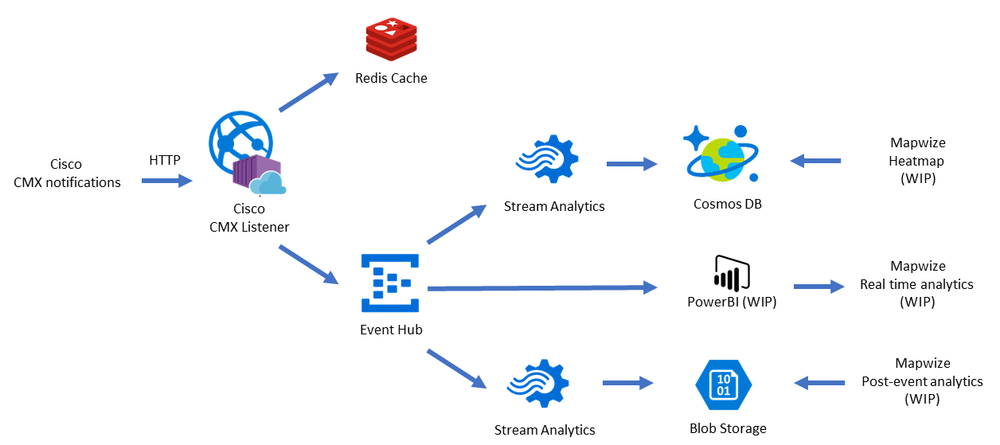
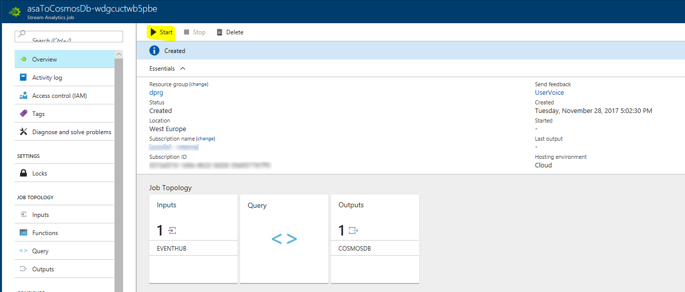

# cmx-azure-data-pipeline

This repository helps you to deploy in 1 click the Cisco CMX notifications listener together with real-time analytics and heatmaps on Azure.

## Architecture overview

This Azure Resource Manager template allows to deploy the following architecture in Azure:



As you can see on the figure above, the data pipeline is composed by several services:

- Cisco CMX Notifications Listener: a Node.js web app running on Web App for Containers. This app is responsible for getting the notifications from the Cisco CMX equipments, convert the information into standard indoor location format, store it into Redis and forward it to Azure Event Hub to enter the data pipeline.

- An Azure Redis Cache that stores the latest position for each devices

- An Azure Event Hub that represents the entry point for the data pipeline

- An Azure Stream Analytics job that transforms the data to be exported into Azure Cosmos Db, for the Mapwize Heatmap

- An Azure Cosmos Db document database that stores the data for the Mapwize Heatmap (Work in Progress)

- An Azure Stream Analytics job that dumps all the data into Azure blob storage for Mapwize post-event analytics (Work in Progress)

- An Azure Storage account that stores the data for Mapwize post-event analytics (Work in Progress)

- (future) an export to Microsoft PowerBI for real time dashboard analytics

## Deploy to Azure

<a href="https://portal.azure.com/#create/Microsoft.Template/uri/https%3A%2F%2Fraw.githubusercontent.com%2FIndoorLocation%2Fcmx-azure-data-pipeline%2Fdevelopment%2Fazuredeploy.json" target="_blank">
    
</a>

<a href="http://armviz.io/#/?load=https%3A%2F%2Fraw.githubusercontent.com%2FIndoorLocation%2Fcmx-azure-data-pipeline%2Fdevelopment%2Fazuredeploy.json" target="_blank">
    
</a>

## Initialize the data pipeline

### Cosmos Db

*Note: you can get the Cosmos Db credentials information in the output of the Azure deployment (once deployment is successfuly completed).*

Create the `records` database:

```bash
az cosmosdb database create --db-name records --key COSMOSDB_KEY_FROM_DEPLOYMENT_OUTPUT --url-connection COSMOSDB_ENDPOINT_FROM_DEPLOYMENT_OUTPUT
```

Create the `records` collection:

```bash
az cosmosdb collection create --collection-name records --db-name records --key COSMOSDB_KEY_FROM_DEPLOYMENT_OUTPUT --url-connection COSMOSDB_ENDPOINT_FROM_DEPLOYMENT_OUTPUT
```

### Start Azure Stream Analytics Jobs

Go into the Azure portal and browse each ASA Jobs that have been created during the deployment and click on Start:

